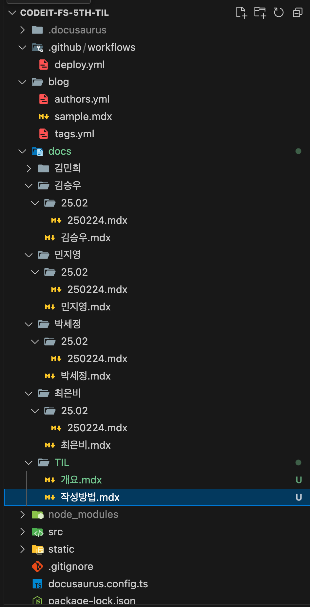
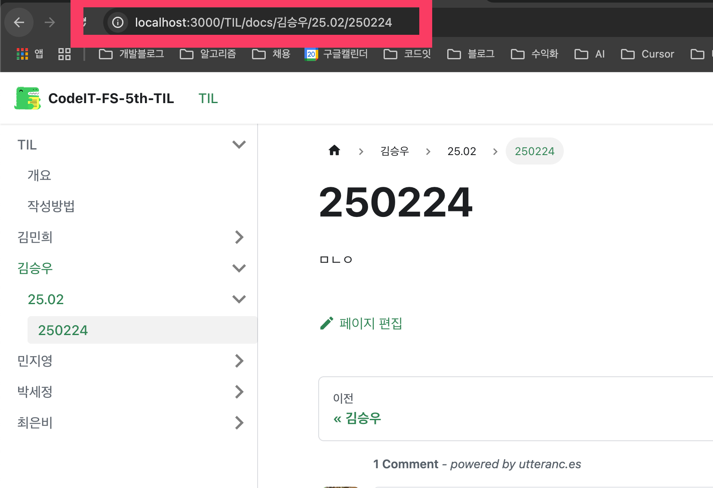

## 다큐사우로스

https://docusaurus.io/

- 페이스북에 만든 오프소스
- 리액트 기반, 문서화 정적 사이트 생성 라이브러리
- 파일 기반 라우팅
- MD 지원
- 다양한 테마 지원 및 리엑트로 커스텀 가능
- 페이스북, 리엑트 등 수 많은 기술들이 기술 문서 플랫폼으로 채택

### 프로젝트 폴더 구조

- docs 폴더 하위에 본인의 이름 안에 작성.
- 본인 이름 -> 년월 폴더 안에 오늘 날짜에 해당하는 md or mdx 파일 생성
- 폴더와 파일 이름 기반으로 라우팅이 생성 됨.

### 작성 방법

- Github 레포를 본인 로컬 환경에 clone
- 다른 분들의 폴더나 다른 곳의 폴더, 파일은 건들지 말고 자신의 폴더에만 추가
- 작성 후 main에 push
  - main에 push하면 github action이 자동 배포함.
- 배포 확인 후, 다른 사람들의 글을 읽고 댓글을 달아주기
