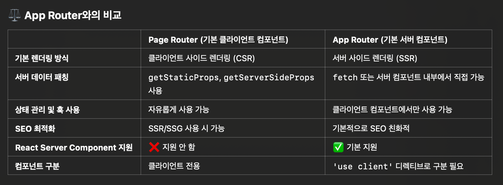

## Next.js, Page Router, App Router에 대해서

### Page Router와 App Router의 차이점



위 표를 보고 드는 의문점은.. Page Router도 다른 설정을 하지 않으면 CSR인데, 

근데 또 강의나 문서를 보면 정적 html을 서버에서 보내준다고 한다. → 그러면 서버에서 보내주는거 아냐? SSG가 기본 아냐? 라고 생각하게 됨.

그래서 React Project(CRA)와 Next.js 프로젝트의 차이점을 비교해보게 됨.

CRA로 만든 프로젝트를 실행해보면, JS가 실행되기 전에는 아래 빈 HTML만 있게 됨.

```html
<!DOCTYPE html>
<html lang="en">
  <head>
    <meta charset="UTF-8" />
    <title>React App</title>
  </head>
  <body>
    <div id="root"></div> <!-- 여기에 렌더링됨 -->
  </body>
</html>
```

그리고 root 위에 리엑트 컴포넌트들이 랜더링 됨.

하지만 Next.js 프로젝트는 build 과정을 거침.

```bash
npm run build
npm run start
```

build과정에서 정적 html이 생성되고, 이를 Next.js 서버에서 줌. → 이게 정적 html을 준다는 의미임.(**정적 최적화(Static Optimization)** 기능)

보통 state가 없는 컴포넌트들에 해당 됨. 

그 외의 API를 호출해야 되거나, state가 있는 컴포넌트는 `getStaticProps` 함수를 사용해야 함.

Next.js가 준 정적 html

```html
<!DOCTYPE html>
<html>
  <head>
    <title>Next.js App</title>
  </head>
  <body>
    <div id="__next">
      <h1>Hello from Next.js!</h1>
    </div>
    <script src="/_next/static/runtime/main.js"></script>
  </body>
</html>
```

CRA는 빈 html만 주지만 Next.js는 아무것도 사용하지 않아도 기본적으로 정적 html를 서버에서 줌 → 그래서 SEO에 좋음.

CRA도 빌드하는 과정은 있지만 빌드 할 때 JS 번들을 만듬.

SSG나 SSR 기능이 내장되어 있지 않기 때문에 무조건 빈 HTML 위에 랜더링 함.

### 결론

- Next.js Page Router를 사용하고 아무런 설정을 해주지 않아도 state가 필요 없는(API 호출 등) 컴포넌트들은 빌드 과정에서 정적 HTML로 변환 됨. → Next.js의 기본 정적 최적화 기능
- CRA는 SSG, SSR을 할 수 없음 → 빌드 시 JS 번들이 생성됨 → 화면에 보여질 때 빈 HTML이 보여지고 그 위에 랜더링 됨.

지피티와 나눈 대화 링크

https://chatgpt.com/share/67bc836b-000c-800a-ae29-36b4fb024ea8

## 나에게 하는 말
- 더 빡세게 집중하자, 내일은 정말 타이머 써서 공부하자
  - 내일 TIL은 뽀모도로 표시하기!
- 더 잘하자, 다른 사람들을 도와주자!
- 공부할 때, 무조건 노션 켜놓고 기록하자
- GPT에게 더 자세하게 그리고 집요하게 물어보자. 이해하면서 공부가 많이 됨.